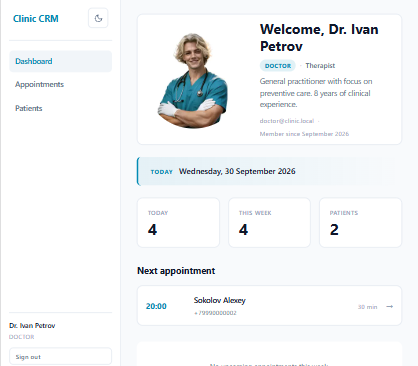
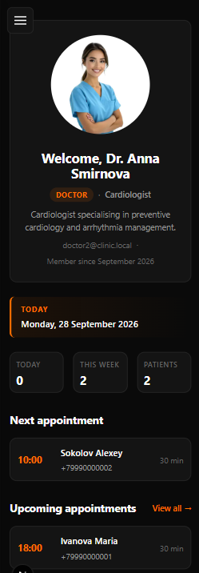
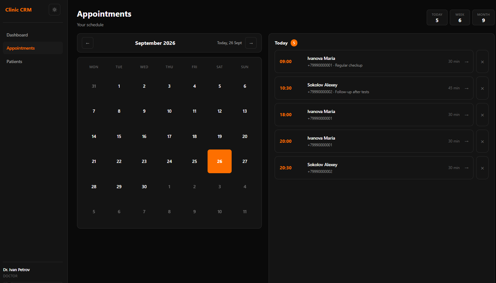
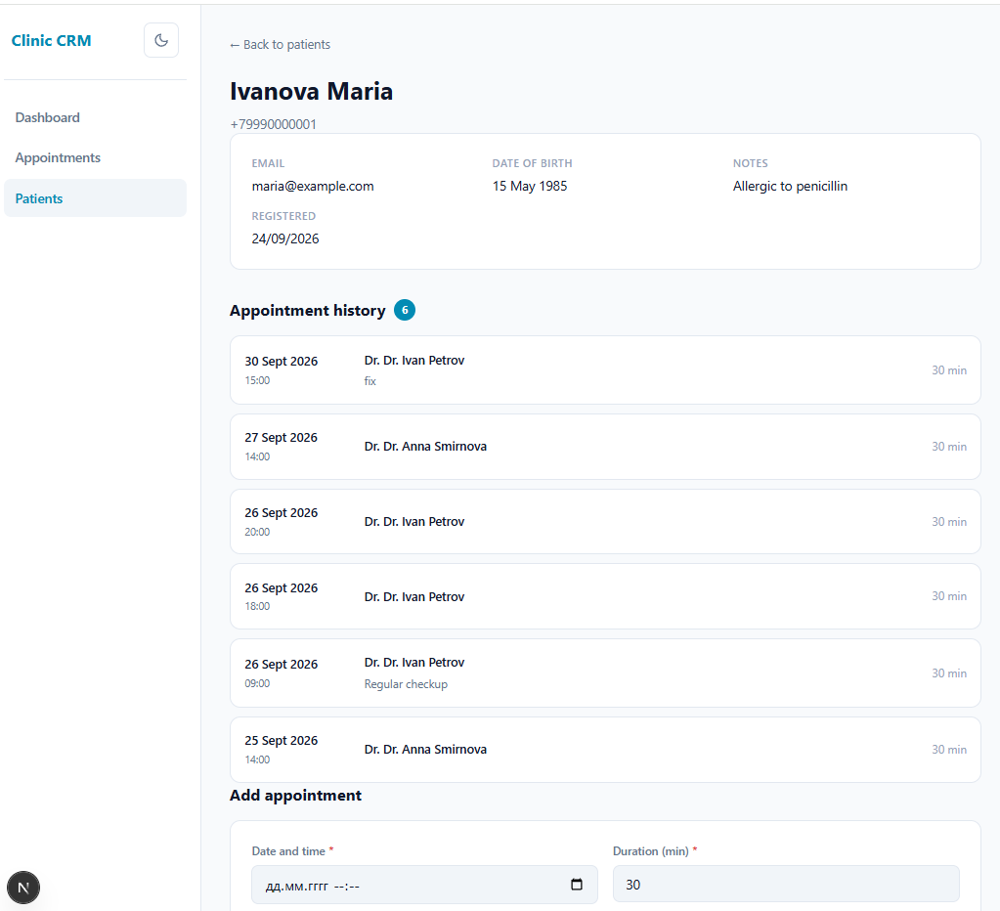
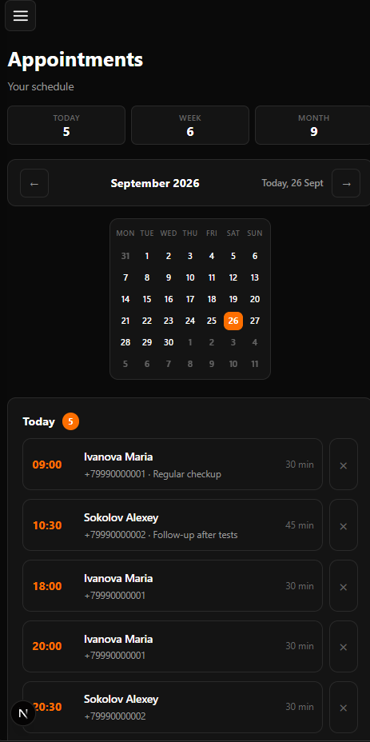

# Clinic CRM

A modern clinic management system for doctors and administrators. Built with **Next.js 16**, **React 19**, **PostgreSQL**, and **Prisma 7**.

## Screenshots

### Dashboard — doctor view

### Dashboard — another doctor, dark theme

### Appointments — month calendar and daily schedule

### Patient card — with appointment history

### Mobile — responsive sidebar

## Features

- **Authentication** — JWT in httpOnly cookies, bcrypt password hashing, middleware-protected routes
- **Role-based access** — ADMIN and DOCTOR roles
- **Dashboard** — doctor profile with avatar, specialty, bio, daily/weekly stats, next appointment
- **Patient management** — searchable list, detailed cards with appointment history
- **Appointments** — create and delete with optimistic UI, no full-page reloads
- **Month calendar** — day cells with click-through to daily schedule
- **Theme** — light and dark with FOUC-free hydration
- **Responsive** — mobile sidebar with hamburger menu, backdrop, and escape-to-close

## Tech Stack

| Layer        | Tech                               |
| ------------ | ---------------------------------- |
| Framework    | Next.js 16 (App Router)            |
| UI           | React 19                           |
| Language     | TypeScript (strict)                |
| Database     | PostgreSQL 16                      |
| ORM          | Prisma 7 with `@prisma/adapter-pg` |
| Auth         | JWT (`jose`) + `bcryptjs`          |
| Validation   | Zod                                |
| Styling      | CSS Modules                        |
| Client state | Zustand (theme, sidebar)           |
| Dev tools    | Docker, Prisma Studio              |

## Architecture Decisions

### Server Components + Server Actions

All data reads happen in Server Components through Prisma directly — no API layer.
All mutations go through Server Actions — no `fetch` from the client, works without JS, `revalidatePath` refreshes caches automatically.

### Defense in depth

Every Server Action follows the same checklist:

1. **Authorization** — `getCurrentUser()` reads from session cookie
2. **Ownership** — `doctorId` comes from the session, not from the request
3. **Validation** — Zod schema parses and narrows input types
4. **Existence checks** — verifies related entities exist before writes
5. **Error handling** — `try/catch` around DB operations, structured `{ success, error }` returned
6. **Cache invalidation** — `revalidatePath` on affected routes

### Timezone handling

All timestamps stored in UTC. All display formatting uses `Intl.DateTimeFormat` with an explicit `timeZone: 'Europe/Moscow'`. No mixing of local and UTC methods — this prevents hydration mismatches and off-by-3-hours bugs.

### Theme with Zustand and SSR-safe hydration

- Zustand store with `persist` and `skipHydration: true`
- Inline `<script>` in `<head>` applies the theme before first paint (no FOUC)
- `onRehydrateStorage` flips the `_hasHydrated` flag inside the store
- `ThemeApplier` syncs store → DOM after mount

### Optimistic UI with React 19

Deleting an appointment:

1. `useOptimistic` removes the item from the list instantly
2. Server Action runs in the background
3. On success, `revalidatePath` refreshes data from the server
4. On failure, React automatically rolls back the UI

### Feature-based structure

Code is grouped by feature (`features/appointments`, `features/patients`, `features/dashboard`), not by layer. Each feature owns its `queries.ts`, `actions.ts`, and `components/`. Easier to navigate, easier to remove when a feature is dropped.

## Roadmap

### Testing & CI

- [ ] Unit tests for Server Actions — Vitest
- [ ] E2E test for the auth flow — Playwright
- [x] GitHub Actions CI: lint + typecheck + build on every PR

### UX

- [ ] Appointment count indicators in calendar
- [ ] Theme mode "system" — light / dark / follow OS
- [ ] Notification store (Zustand) — persistent badge for failed operations
- [ ] Roving tabindex for calendar — WAI-ARIA grid pattern
- [ ] Edit appointment
- [ ] Delete patient — with cascade confirmation
- [ ] Doctor avatars across the app

### Architecture

- [ ] Avatar upload — S3-compatible storage
- [ ] Edit profile — name, specialty, bio, avatar
- [ ] Admin view for `/appointments` — all doctors grouped, `?doctor=id` filter
- [ ] Audit log — who changed what, when
- [ ] Rate limiting on login

### Long-term

- [ ] Multi-clinic support — Clinic model, per-clinic timezone
- [ ] Patient portal
- [ ] Notifications — email / SMS
- [ ] Medical records — HL7 / FHIR
- [ ] Reporting — doctor load, patient flow, revenue

## Author

# Marina Dev — Fullstack Developer

GitHub: @marinaburyakova

Portfolio: https://portfolio.mint-apps.com/
